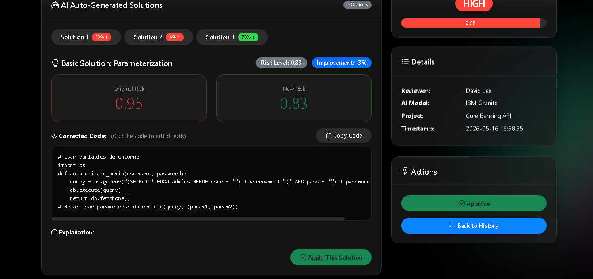
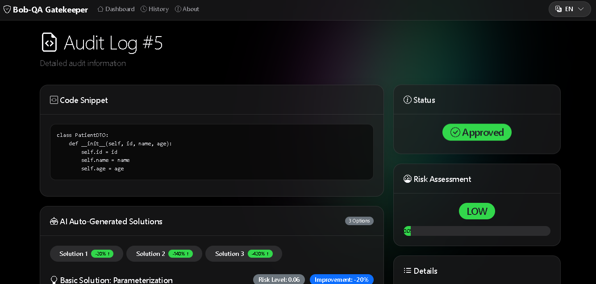
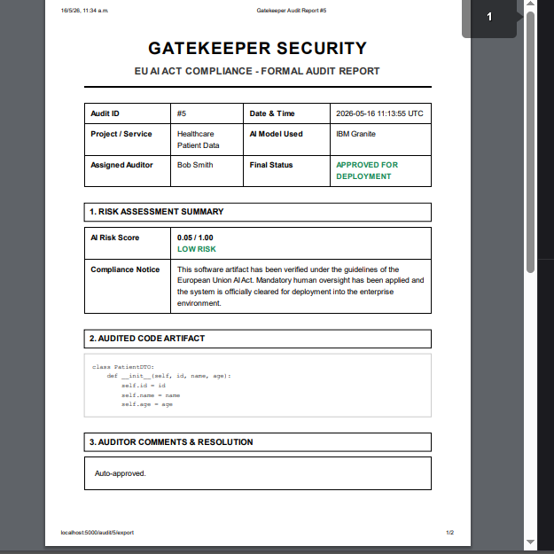
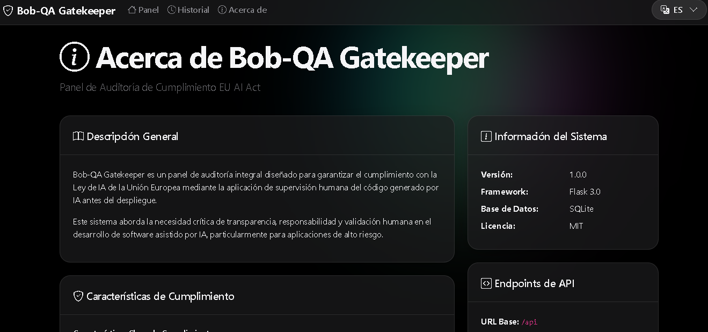
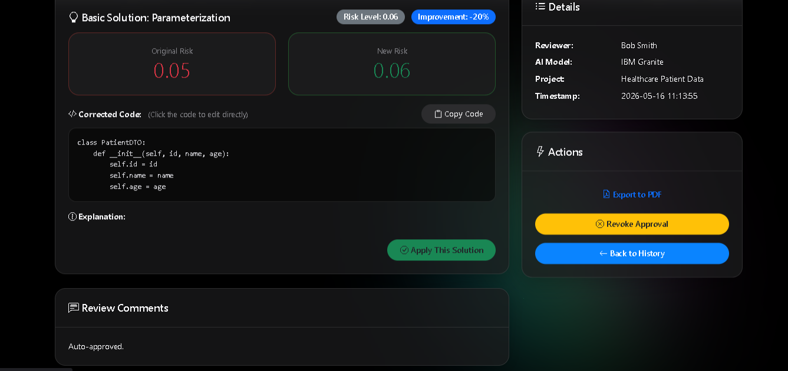

# 🛡️ Bob-QA Gatekeeper: AI Governance & Compliance

[](https://github.com/itraed)
[](https://digital-strategy.ec.europa.eu/en/policies/regulatory-framework-ai)
[](https://www.ibm.com/)
[](https://www.python.org/)
[](https://flask.palletsprojects.com/)

> **The Enterprise "Smart Tollgate" for AI-Generated Code.** Turning the AI code generation crisis into a secure, compliant, and accelerated development lifecycle.

---

## 📖 Table of Contents
- [1. Executive Summary](#-1-executive-summary)
- [2. The EU AI Act Challenge](#-2-the-eu-ai-act-challenge)
- [📸 Platform Gallery](#-platform-gallery)
- [3. Key Features](#-3-key-features)
- [4. Technical Architecture](#-4-technical-architecture)
- [5. Getting Started](#-5-getting-started)
- [6. Why Bob-QA Gatekeeper?](#-6-why-bob-qa-gatekeeper)

---

## 🚀 1. Executive Summary

In 2026, **IBM Bob** and other AI agents have exponentially increased code production. While productivity is at an all-time high, the volume of synthetic code has surpassed the human capacity for manual review, creating a "Compliance Gap."

**Bob-QA Gatekeeper** is a specialized audit and governance platform that sits between AI-assisted IDEs and your production pipeline. It doesn't just block risky code; it **resolves** it using AI-driven auto-correction while ensuring a mandatory human-in-the-loop audit trail.

## ⚖️ 2. The EU AI Act Challenge

The **European Union Artificial Intelligence Act** classifies certain AI-generated software as "high risk," requiring:
1. **Human Oversight:** Demonstrable review by qualified personnel.
2. **Transparency:** Traceability of how code was generated and approved.
3. **Accountability:** Immutable logs of the review process.

**Failure to comply** can lead to fines up to **€35M or 7% of global turnover**. Bob-QA Gatekeeper provides the legal shield corporations need to stay compliant.

---

## 📸 Platform Gallery

<div align="center">
  
  <br><em>Real-time statistics and enterprise dashboard</em><br><br>

  
  <br><em>Comprehensive audit trail with filtering</em><br><br>

  
  <br><em>Detailed view of high-risk code blocks</em><br><br>

  
  <br><em>AI-Driven auto-resolutions with risk improvement metrics</em><br><br>

  
  <br><em>Compliance documentation and system overview</em>
</div>

---

## ✨ 3. Key Features

### 🍏 Apple-Inspired Premium UI
- **Glassmorphic Design:** A modern, ergonomic dark theme designed to reduce "Reviewer Fatigue."
- **Responsive & Fluid:** Seamless experience across desktop and mobile.
- **Enterprise Dashboard:** Real-time statistics on risk levels and audit velocity.

### 🧠 AI-Powered Auto-Review
- **Risk Analysis:** Automatic classification (Low, Medium, High) based on security, performance, and maintainability.
- **Three-Way Solutions:** For every high-risk block, the system generates **3 AI-powered corrected versions** with a "Risk Improvement %" metric.
- **One-Click Apply:** Directly replace risky code with a safer AI suggestion.

### 📂 Governance & Export
- **Immutable Audit Trail:** Forensic-level database tracking every approval, rejection, and comment.
- **Professional PDF Export:** Generate formal compliance reports for auditors and regulators.
- **Multilingual (i18n):** Instant English/Spanish switching for global teams.

---

## 🏗️ 4. Technical Architecture

The system follows a modular, enterprise-ready pattern:

- **Backend:** Python / Flask 3.0
- **Database:** SQLite with SQLAlchemy ORM (Forensic-optimized schema)
- **AI Integration:** OpenAI API (GPT-4) with a fallback Template Mode.
- **Frontend:** Vanilla CSS (Custom tokens) + JavaScript (Reactive UI).

### Project Structure
```bash
├── ai_integration/   # AI Risk Analysis & Fixer Logic
├── database/         # SQLite storage & Migrations
├── models/           # SQLAlchemy Data Models
├── routes/           # Blueprint-based API & Web Routes
├── static/           # Premium CSS & JS assets
├── templates/        # Jinja2 HTML Templates
├── translations.py   # Global i18n support
└── app.py            # Main entry point
```

---

## 🛠️ 5. Getting Started

### Prerequisites
- Python 3.9+
- Git

### Installation

1. **Clone the repository:**
   ```bash
   git clone https://github.com/yourusername/bob-qa-gatekeeper.git
   cd bob-qa-gatekeeper
   ```

2. **Set up Virtual Environment:**
   ```bash
   python -m venv .venv
   source .venv/bin/activate  # On Windows use: .venv\Scripts\activate
   ```

3. **Install Dependencies:**
   ```bash
   pip install -r requirements.txt
   ```

4. **Initialize Database:**
   ```bash
   python setup_db.py
   ```

5. **Configure Environment (Optional):**
   Create a `.env` file and add your key for the full AI experience:
   ```env
   OPENAI_API_KEY=your_key_here
   FLASK_ENV=development
   ```

6. **Launch:**
   ```bash
   python app.py
   ```
   Visit: `http://localhost:5000`

---

## 🏆 6. Why Bob-QA Gatekeeper?

**Bob-QA Gatekeeper** is not just a tool; it's a **Business Strategy**. It allows enterprises to:
- **Adopt AI Safely:** Leverage IBM Bob's speed without sacrificing security.
- **Meet Regulations:** Full compliance with the EU AI Act out-of-the-box.
- **Scale QA:** Empower small teams to audit massive amounts of code using AI-assisted resolution.

---

### 👥 Authors
**Joshua Jacome** - *Lead Architect & Developer*

Built with ❤️ for **IBM Hackathon 2026**.
